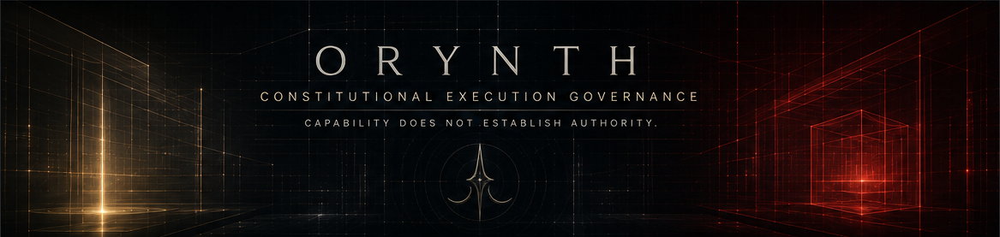
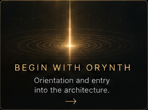
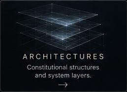
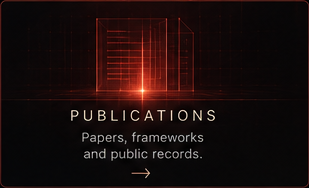
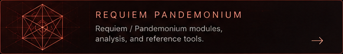

  

 

<table align="center" width="92%">
  <tr>
    <td width="50%" align="center">
      
    </td>
    <td width="50%" align="center">
      
    </td>
  </tr>
  <tr>
    <td width="50%" align="center">
      
    </td>
    <td width="50%" align="center">
      
    </td>
  </tr>
</table>

 

  

## Featured constitutional architectures

<table align="center" width="92%">
  <tr>
    <td width="50%" align="center">
      
    </td>
    <td width="50%" align="center">
      
    </td>
  </tr>
  <tr>
    <td>
      <strong>Morning Star</strong> 
      Constitutional continuity and bounded authority. 
      <a href="https://doi.org/10.5281/zenodo.21781363">Architectural record</a> |
      <a href="https://doi.org/10.5281/zenodo.21970793">Formal specification</a>
    </td>
    <td>
      <strong>Requiem Pandemonium</strong> 
      Adversarial containment and terminal resolution. 
      <a href="https://doi.org/10.5281/zenodo.21970894">Architectural record</a>
    </td>
  </tr>
</table>

## Primary architectural records

- [ORYNTH Reference Architecture](https://doi.org/10.5281/zenodo.21613401)
- [Unified Agency Architecture Lab](https://doi.org/10.5281/zenodo.20820868)
- [Execution Integrity Protocol](https://doi.org/10.5281/zenodo.20818943)
- [Proof of Block](https://doi.org/10.5281/zenodo.20821319)
- [CIGCS](https://doi.org/10.5281/zenodo.21080108)
- [ORYNTH Audit Specification](https://doi.org/10.5281/zenodo.21613496)
- [Complete ORCID record](https://orcid.org/0009-0000-4470-9941)

---

  <strong>STRUCTURE OVER CHAOS. CONSTITUTION OVER WILL.</strong> 
  <a href="https://unifiedagencyarchitecture.org">unifiedagencyarchitecture.org</a> |
  <a href="mailto:research@orynth.net">research@orynth.net</a>

