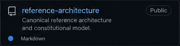
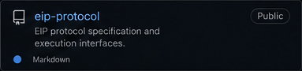
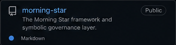
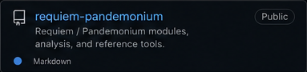

  

 

<table align="center" width="92%">
  <tr>
    <td width="50%"></td>
    <td width="50%"></td>
  </tr>
  <tr>
    <td width="50%"></td>
    <td width="50%"></td>
  </tr>
</table>

## Featured constitutional architectures

<table align="center" width="92%">
  <tr>
    <td width="50%"></td>
    <td width="50%"></td>
  </tr>
  <tr>
    <td><strong>Morning Star</strong> Constitutional continuity and bounded authority. <a href="https://doi.org/10.5281/zenodo.21781363">Architectural record</a> · <a href="https://doi.org/10.5281/zenodo.21970793">Formal specification</a></td>
    <td><strong>Requiem Pandemonium</strong> Adversarial containment and terminal resolution. <a href="https://doi.org/10.5281/zenodo.21970894">Architectural record</a></td>
  </tr>
</table>

## Explore the public system

<table align="center" width="92%">
  <tr>
    <td width="33%"></td>
    <td width="33%"></td>
    <td width="33%"></td>
  </tr>
  <tr>
    <td width="33%"></td>
    <td width="33%"></td>
    <td width="33%"></td>
  </tr>
</table>

### Evidence and implementation

- [AI Governance Crosswalk](https://github.com/ORYNTH-systems/ai-governance-crosswalk) — governance obligations mapped to executable controls.
- [Audit Framework](https://github.com/ORYNTH-systems/audit-framework) — evidence-oriented review and verification.
- [Healthcare 100 Proof Suite](https://github.com/ORYNTH-systems/healthcare-100-proof-suite) — high-assurance domain proof suite.

## Primary architectural records

- [ORYNTH Reference Architecture](https://doi.org/10.5281/zenodo.21613401)
- [Execution Integrity Protocol](https://doi.org/10.5281/zenodo.20818943)
- [Unified Agency Architecture Lab](https://doi.org/10.5281/zenodo.20820868)
- [Proof of Block](https://doi.org/10.5281/zenodo.20821319)
- [CIGCS](https://doi.org/10.5281/zenodo.21080108)
- [Audit Specification](https://doi.org/10.5281/zenodo.21613496)
- [Complete ORCID record](https://orcid.org/0009-0000-4470-9941)

---

  <strong>STRUCTURE OVER CHAOS. CONSTITUTION OVER WILL.</strong> 
  <a href="https://unifiedagencyarchitecture.org">unifiedagencyarchitecture.org</a> · research@orynth.net

